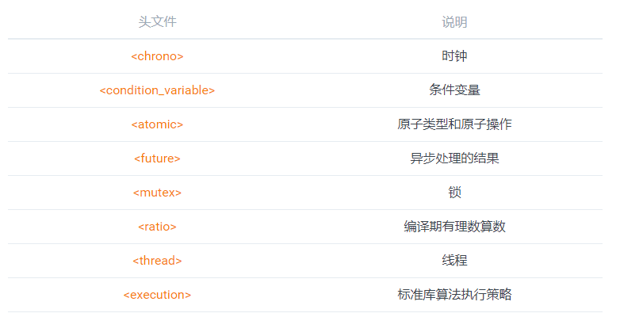
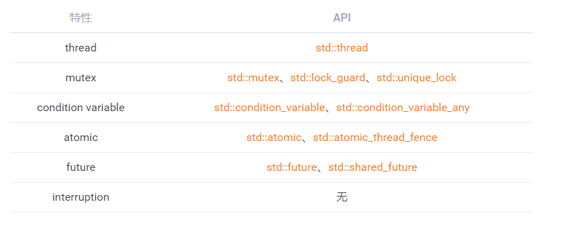
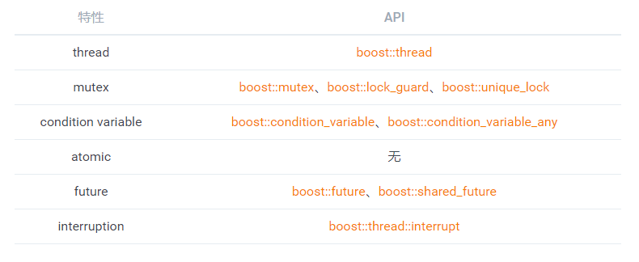
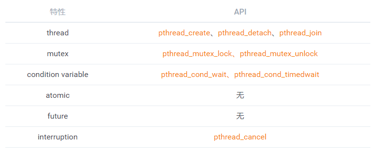

.. contents::
   :depth: 3
..

附录
====

标准库相关头文件
----------------

|image0|

并发库对比
----------

`C++11 Thread <https://en.cppreference.com/w/cpp/thread>`__
~~~~~~~~~~~~~~~~~~~~~~~~~~~~~~~~~~~~~~~~~~~~~~~~~~~~~~~~~~~

|image1|

`Boost Thread <https://www.boost.org/doc/libs/1_71_0/doc/html/thread.html>`__
~~~~~~~~~~~~~~~~~~~~~~~~~~~~~~~~~~~~~~~~~~~~~~~~~~~~~~~~~~~~~~~~~~~~~~~~~~~~~

|image2|

`POSIX Thread <http://pubs.opengroup.org/onlinepubs/9699919799/basedefs/pthread.h.html>`__
~~~~~~~~~~~~~~~~~~~~~~~~~~~~~~~~~~~~~~~~~~~~~~~~~~~~~~~~~~~~~~~~~~~~~~~~~~~~~~~~~~~~~~~~~~

|image3|

