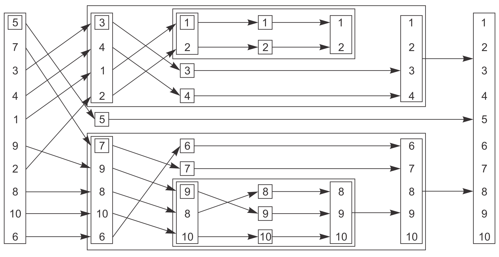

# 同步并发操作

## 等待一个事件或其他条件

一个线程要等待另一个线程完成任务，确定完成任务的方法有几种。第一种是持续检查  `mutex`，这种方法显然很浪费资源。第二种是每隔一段时间进行一次检查。

```
bool flag;
std::mutex m;

void f()
{
    std::unique_lock<std::mutex> l(m);
    while (!flag)
    {
        l.unlock();
        std::this_thread::sleep_for(std::chrono::milliseconds(100)); //@ 休眠100ms
        //@ 休眠期间其他线程就有机会获取mutex并设置flag
        l.lock();
    }
}
```

但很难确定适当的休眠时间，过长（会直接影响程序行为，很少见）过短（相当于没有，一样浪费资源）都不好。

### 条件变量

第三种方案是使用条件变量（condition variable），标准库对条件变量提供了两种实现：[std::condition_variable ](https://en.cppreference.com/w/cpp/thread/condition_variable)和 [std::condition_variable_any](https://en.cppreference.com/w/cpp/thread/condition_variable_any)，前者仅限和 [std::mutex ](https://en.cppreference.com/w/cpp/thread/mutex)工作，而后者可以与任何满足最低标准的  `mutex` 工作（因此加上 `_any` 的后缀），更通用也意味着更大的开销，因此一般首选使用前者。

```
std::mutex m;
std::condition_variable cv;
std::string data;
bool ready = false;
bool processed = false;

void f()
{
	std::unique_lock<std::mutex> l(m);
	cv.wait(l, [] {return ready; });
	data += " after processing";
	processed = true;
	l.unlock();
	cv.notify_one();
}

int main()
{
	std::thread t(f);
	data = "data";

	//@ 使用{}包围是为了给 lock_guard 创建一个局部作用域
	{
		std::lock_guard<std::mutex> l(m);
		data += " ready";
		ready = true;
		cv.notify_one();   //@ 唤醒 cv.wait
	}
	{
		std::unique_lock<std::mutex> l(m);
		cv.wait(l, [] {return processed; });
	}

	std::cout << data << "\n";
	t.join();
}
```

- `wait()` 中加入了 lambda 表达式用于判断相应的条件是否真正的达成，这是为了避免虚假唤醒导致的错误。
- `wait()` 传入的参数只能是 `std::unique_lock` 而不可以是 `std::lock_guard`。
  -  在 `wait()` 函数之前，使用互斥锁保护了，如果 `wait` 的条件没有达成，`wait()` 函数会先调用互斥锁的 `unlock()` 函数，然后再将自己休眠，在被唤醒后，又会继续持有锁。
  - `lock_guard` 没有 `lock` 和 `unlock` 接口，而 `unique_lock` 提供了相应的接口。

## 用条件变量实现线程安全的queue

和 [std::stack](https://en.cppreference.com/w/cpp/container/stack) 一样，[std::queue ](https://en.cppreference.com/w/cpp/container/queue)的接口设计存在固有竞争，因此需要将 `front` 和 `pop` 合并成一个函数（就像合并 [std::stack](https://en.cppreference.com/w/cpp/container/stack) 的 `top` 和 `pop`）。这里提供了 `pop` 的两个变种 ：

- `try_pop` 总会直接返回（即使没有可弹出的值）。
- `wait_and_pop` 等待有值可检索才返回。

```
#include <mutex>
#include <condition_variable>
#include <queue>

template<typename T>
class threadsafe_queue
{
	mutable std::mutex m;
	std::queue<T> q;
	std::condition_variable cv;
public:
	threadsafe_queue(){}
	threadsafe_queue(const threadsafe_queue& rhs)
	{
		std::lock_guard<std::mutex>l(m);
		q = rhs.q;
	}

	void push(T x)
	{
		std::lock_guard<std::mutex>l(m);
		q.push(std::move(x));
		cv.notify_one();
	}

	void wait_and_pop(T &x)
	{
		std::unique_lock<std::mutex> l(m);
		cv.wait(l, [this] {return !q.empty(); });
		x = std::move(q.front());
		q.pop();
	}

	std::shared_ptr<T> wait_and_pop()
	{
		std::unique_lock<std::mutex> l(m);
		cv.wait(l, [this] {return !q.empty(); });
		std::shared_ptr<T> res(std::make_shared<T>(std::move(q.front())));
		q.pop();
		return res;
	}

	bool try_pop(T& x)
	{
		std::lock_guard<std::mutex>l(m);
		if (q.empty())
			return false;
		x = std::move(q.front());
		return true;
	}

	std::shared_ptr<T> try_pop()
	{
		std::lock_guard<std::mutex>l(m);
		if (q.empty())
			return false;
		std::shared_ptr<T> res(std::make_shared<T>(std::move(q.front())));
		return true;
	}

	bool empty() const
	{
		std::lock_guard<std::mutex> l(m);
		//@ 其他线程可能有此对象（拷贝构造）所以要上锁
		return q.empty();
	}
};
```

## 使用期值等待一次性事件

标准库提供了只能关联一个事件的唯一期值 [std::future](https://en.cppreference.com/w/cpp/thread/future) 和能关联多个事件的共享期值 [std::shared_future](https://en.cppreference.com/w/cpp/thread/shared_future)，[并发TS ](https://en.cppreference.com/w/cpp/experimental/concurrency)中扩展了这两个类，分别为 [std::experimental::future ](https://en.cppreference.com/w/cpp/experimental/future)和 [std::experimental::shared_future](https://en.cppreference.com/w/cpp/experimental/shared_future) 。

最简单的一次性事件就是运行在后台的计算结果，而 [std::thread ](https://en.cppreference.com/w/cpp/thread/thread)不能获取返回值：

```
int f()
{
    return 1;
}

int main()
{
    std::thread t(f); //@ 如何读取f的返回值？
    t.join();
}
```

### async

使用 [std::async](https://en.cppreference.com/w/cpp/thread/async) 可以启动一个异步任务，它返回一个持有计算结果的 [std::future](https://en.cppreference.com/w/cpp/thread/future)，通过 [std::future::get ](https://en.cppreference.com/w/cpp/thread/future/get)即可阻塞线程，直到期值的状态为 `ready`并返回该结果。

```
#include <iostream>
#include <thread>
#include <future>

int f()
{
	return 1;
}

int main()
{
	std::future<int> ft = std::async(f);
	std::cout << ft.get()<<"\n"; //@ 1
}
```

[std::async ](https://en.cppreference.com/w/cpp/thread/async)和 [std::thread](https://en.cppreference.com/w/cpp/thread/thread)一样支持额外的函数参数：

```
//@ 函数
int f(int);
auto ft = std::async(f, 42);

//@ 成员函数
struct A {
	int x{0};
	int f(int)
	{
		x++;
		return 1;
	}
};

A a;
auto ft1 = std::async(&A::f, &a, 42); //@ 调用 p->f(42),p是指向a的对象
auto ft2 = std::async(&A::f, a, 42); //@ 调用 tmpa.f(42),tmpa是a的副本

//@ 函数对象
struct A {
	int operator()(int);
};

A a;
auto ft1 = std::async(A(), 42); //@ 调用tmpa(42)，tmpa由A的移动构造函数获得
auto ft2 = std::async(std::ref(a), 42); //@ 调用a(42)
```

[std::async ](https://en.cppreference.com/w/cpp/thread/async) 还可以设置第一个参数为线程的创建策略：

- `std::launch::async`：函数必须异步执行，即运行在不同的线程上。
- `std::launch::deferred`：函数只在返回的期值调用 `get` 或 `wait` 时运行。
- 不指定时的默认启动策略是对两者进行或运算的结果。

```
int f();
auto ft1 = std::async(std::launch::async, f);
auto ft2 = std::async(std::launch::deferred, f);
auto ft3 = std::async(std::launch::async | std::launch::deferred, f);
```

### packaged_task

除了 [std::async](https://en.cppreference.com/w/cpp/thread/async)，还可以用 [std::packaged_task ](https://en.cppreference.com/w/cpp/thread/packaged_task)让 [std::future ](https://en.cppreference.com/w/cpp/thread/future)与任务关联。

- [std::packaged_task ](https://en.cppreference.com/w/cpp/thread/packaged_task) 对一个函数或可调用对象绑定一个期望，当 [std::packaged_task ](https://en.cppreference.com/w/cpp/thread/packaged_task) 的对象被调用时，它就会调用相关函数或者可调用对象，将期望状态设置为就绪，返回值也会被存储为相关数据。
- [std::packaged_task ](https://en.cppreference.com/w/cpp/thread/packaged_task) 的模板参数是一个函数签名，当实例化一个 [std::packaged_task ](https://en.cppreference.com/w/cpp/thread/packaged_task) 对象时，需要传入一个函数或者可调用对象，这个函数或可调用对象需要指定能接收指定的参数和返回可转换为指定返回类型的值。
- 当需要异步任务的返回值时，可以等待期望的转态变为就绪。

```
int f() { return 42; }

int main()
{
	std::packaged_task<int()> pt(f);
	std::future<int> ft = pt.get_future();
	pt(); //@ 调用std::packaged_task对象，将std::future设为就绪
	std::cout << ft.get()<<"\n";
}
```

很多GUI架构要求用指定线程更新GUI，如果另一个线程要更新GUI，就需要发送信消息给指定线程。使用 [std::packaged_task](https://en.cppreference.com/w/cpp/thread/packaged_task) 即可实现此功能。

```
std::mutex m;
std::deque<std::packaged_task<void()>> d;

//@ 更新GUI的线程
void gui_thread()
{
	while (!gui_shutdown_message_received()) //@ 未收到终止消息则一直轮询
	{
		process_gui_message(); //@ 处理收到的消息
		std::packaged_task<void()> pt;
		{
			std::lock_guard<std::mutex> l(m);
			if (d.empty())
				continue; //@ 任务队列为空时，继续循环
			pt = std::move(d.front());
			d.pop_front();
		}
		pt(); //@ 执行任务，当任务执行完成时，其状态会被设置为就绪状态
	}
}

std::thread t(gui_thread);

//@ 将一个任务传入队列
template<typename F>
std::future<void> postTask(F f)
{
	std::packaged_task<void()> pt(f); //@ 提供一个打包好的任务
	std::future<void> res = pt.get_future(); //@ 获取期望
	std::lock_guard<std::mutex> l(m);
	d.push_back(std::move(pt));
	return res;
}
```

### promise

[std::promise<T> ](https://en.cppreference.com/w/cpp/thread/promise)可以设定值(类型为T)

```
std::promise<int> ps;
std::future<int> ft = ps.get_future();
ps.set_value(42); //@ set_value还会将状态设置为就绪
std::cout << ft.get() << "\n"; //@ 42
```

在线程间对状态发送信号：

```
void f(std::promise<void> ps)
{
	std::this_thread::sleep_for(std::chrono::seconds(1));
	ps.set_value();
}

int main()
{
	std::promise<void> ps;
	std::future<void> ft = ps.get_future();
	std::thread t(f, std::move(ps));
	ft.wait(); //@ 阻塞直到set_value，相当于没有返回值的get
	t.join();
}
```

一个 [std::promise](https://en.cppreference.com/w/cpp/thread/promise) 只能关联一个 [std::future](https://en.cppreference.com/w/cpp/thread/future)，关联多次时将抛出 [std::future_error](https://en.cppreference.com/w/cpp/thread/future_error) 异常：

```
std::promise<int> ps;
auto ft1 = ps.get_future();
auto ft2 = ps.get_future(); //@ 抛出std::future_error异常
```

### 将异常存储于期值中

```
int f(int x)
{
    if (x < 0)
    {
        throw std::out_of_range("x < 0");
    }
    return 1;
}

int main()
{
    auto ft = std::async(f, -1); //@ ft将存储异常
    int x = ft.get(); //@ 抛出已存储的异常
}
```

[std::promise ](https://en.cppreference.com/w/cpp/thread/promise) 也支持此功能：

```
int main()
{
	std::promise<int> ps;
	auto ft = ps.get_future();
	std::thread t([&ps]
	{
		try
		{
			ps.set_value(f(-1)); //@ 此时还没有存储异常
		}
		catch (...)
		{
			ps.set_exception(std::current_exception()); //@ 存储异常
		}
	});
	t.join();
	ft.get(); // 抛出异常
}
```

如果 [std::packaged_task ](https://en.cppreference.com/w/cpp/thread/packaged_task)和 [std::promise ](https://en.cppreference.com/w/cpp/thread/promise)直到析构都未设置值，[std::future::get ](https://en.cppreference.com/w/cpp/thread/future/get)也会抛出 [std::future_error ](https://en.cppreference.com/w/cpp/thread/future_error) 异常。

```
int f();

int main()
{
	std::future<int> ft;
	{
		std::packaged_task<int()> pt(f);
		ft = pt.get_future();
	}
	ft.get(); //@ 抛出异常
}
```

### shared_future

[std::future ](https://en.cppreference.com/w/cpp/thread/future)调用 [get ](https://en.cppreference.com/w/cpp/thread/future/get) 后就无法再次 [get](https://en.cppreference.com/w/cpp/thread/future/get)，也就是说只能获取一次数据，此外还会导致所在线程与其他线程数据不同步。[std::shared_future](https://en.cppreference.com/w/cpp/thread/shared_future) 就可以解决此问题。

```
std::promise<int> ps;
std::future<int> ft(ps.get_future());
assert(ft.valid());
std::shared_future<int> sf(std::move(ft));
assert(!ft.valid());
assert(sf.valid());
```

也可以直接构造：

```
std::promise<int> ps;
//@ std::future隐式转换为std::shared_future
std::shared_future<int> sf(ps.get_future());
```

用 [std::future::share](https://en.cppreference.com/w/cpp/thread/future/share) 可以直接生成 [std::shared_future](https://en.cppreference.com/w/cpp/thread/shared_future)，这样就可以直接用auto简化声明 [std::shared_future](https://en.cppreference.com/w/cpp/thread/shared_future) 。

```
std::promise<int> ps;
auto sf = ps.get_future().share();
```

每一个 [std::shared_future ](https://en.cppreference.com/w/cpp/thread/shared_future)对象上返回的结果不同步，为了避免多线程访问同一 [std::shared_future ](https://en.cppreference.com/w/cpp/thread/shared_future)对象时的数据竞争就必须加锁保护。更好的方法是给每个线程拷贝一个 [std::shared_future ](https://en.cppreference.com/w/cpp/thread/shared_future)对象，这样就可以安全访问而无需加锁。

## 限定等待时间

阻塞调用的时间不确定，在一些情况下需要限制等待时间。指定超时的方式有两种，一是指定一段延迟的时间，另一种是指定一个时间点。

### clock

对于标准库来说，时钟就是时间信息源。具体来说，时钟是提供了四种信息的类：

- 当前时间：如： [std::chrono::system_clock::now()](https://en.cppreference.com/w/cpp/chrono/system_clock/now)
- 表示时间值的类型：[std::chrono::time_point](https://en.cppreference.com/w/cpp/chrono/time_point)
- 时钟节拍（一个嘀嗒的周期）：一般一秒有25个节拍，一个周期则为 [std::ratio](https://en.cppreference.com/w/cpp/numeric/ratio/ratio)
- 通过时钟节拍确定时钟是否稳定（steady，匀速）：
  - [std::chrono::steady_clock::is_steady](https://en.cppreference.com/w/cpp/chrono/steady_clock)（稳定时钟，代表系统时钟的真实时间）
  - [std::chrono::system_clock::is_steady](https://en.cppreference.com/w/cpp/chrono/system_clock)（一般因为时钟可调节而不稳定，即使这是为了考虑本地时钟偏差的自动调节）
  - [high_resolution_clock::is_steady](https://en.cppreference.com/w/cpp/chrono/high_resolution_clock)（最小节拍最高精度的时钟）

打印当前的系统时间：

```
#include <iostream>
#include <ctime>
#include <chrono>
#include <iomanip>

int main()
{
	std::chrono::system_clock::time_point now = std::chrono::system_clock::now();
	std::time_t now_c = std::chrono::system_clock::to_time_t(now);
	//@  %F即%Y-%m-%d，%T即%H:%M:%S
	std::cout << std::put_time(std::localtime(&now_c),"%F %T")<<"\n"; 
}
```

### chrono::duration

标准库提供了表示时间间隔类型的 [std::chrono::duration ](https://en.cppreference.com/w/cpp/chrono/duration)：

```
//@ 表示秒的类型
std::chrono<int> //@ 即：std::chrono::seconds
//@ 表示分钟的类型
std::chrono<int,std::ratio<60>> //@ 即：std::chrono::minutes
//@ 表示毫秒的类型
std::chrono<int, std::ratio<1,1000>> //@ 即：std::chrono::milliseconds
```

C++14 的 [std::chrono_literals](https://en.cppreference.com/w/cpp/language/user_literal%23Standard_library) 提供了表示时间的后缀：

```
using namespace std::chrono_literals;
auto x = 45min; //@ 等价于std::chrono::minutes(45)
std::cout << x.count(); //@ 45
auto y = std::chrono::duration_cast<std::chrono::seconds>(x);
std::cout << y.count(); //@ 2700
auto z = std::chrono::duration_cast<std::chrono::hours>(x);
std::cout << z.count(); //@ 0（转换会截断）
```

标准库通过字面值运算符模板实现此后缀功能:

```
constexpr std::chrono::minutes operator ""min(unsigned long long m)
{
    return std::chrono::minutes(m);
}
```

`duration` 支持四则运算：

```
using namespace std::chrono_literals;
auto x = 1h;
auto y = 15min;
auto z = x - 2 * y;
std::cout << z.count(); //@ 30
```

使用 `duration` 即可设置等待时间：

```
int f();
auto ft = std::async(f);

using namespace std::chrono_literals;
if (ft.wait_for(1s) == std::future_status::ready)
{
    std::cout << ft.get();
}
```

### chrono::time_point

`time_point` 是表示时间的类型，值为从某个时间点（比如 unix 时间戳：1970年1月1日0时0分）开始计时的时间长度。

```
//@ 第一个模板参数为开始时间点的时钟类型，第二个为时间单位
std::chrono::time_point<std::chrono::system_clock, std::chrono::seconds>
```

`time_point` 可以加减 `dutation`：

```
using namespace std::chrono_literals;
auto x = std::chrono::high_resolution_clock::now();
auto y = x + 1s;
std::cout << std::chrono::duration_cast<std::chrono::milliseconds>(y - x).count();
```

两个 `time_point` 也能相减：

```
auto start = std::chrono::high_resolution_clock::now();
doSomething();
auto stop = std::chrono::high_resolution_clock::now();
std::cout << std::chrono::duration_cast<std::chrono::milliseconds>(stop - start).count();
```

使用绝对的时间点来设置等待时间：

```
std::condition_variable cv;
bool done;
std::mutex m;

bool wait_loop()
{
    const auto timeout = std::chrono::steady_clock::now() + std::chrono::milliseconds(500);
    std::unique_lock<std::mutex> l(m);
    while (!done)
    {
        if (cv.wait_until(l, timeout) == std::cv_status::timeout) break;
    }
    return done;
}
```

### 接受timeout的函数

`timeout` 可以用于休眠，比如 [std::this_thread::sleep_for](https://en.cppreference.com/w/cpp/thread/sleep_for) 和 [std::this_thread::sleep_until](https://en.cppreference.com/w/cpp/thread/sleep_until)，此外  `timeout` 还能配合条件变量、期值甚至 `mutex` 使用。

[std::mutex ](https://en.cppreference.com/w/cpp/thread/mutex)和 [std::recursive_mutex ](https://en.cppreference.com/w/cpp/thread/recursive_mutex) 不支持timeout，而 [std::timed_mutex ](https://en.cppreference.com/w/cpp/thread/timed_mutex)和 [std::recursive_timed_mutex](https://en.cppreference.com/w/cpp/thread/recursive_timed_mutex) 支持，它们提供了 [try_lock_for ](https://en.cppreference.com/w/cpp/thread/timed_mutex/try_lock_for) 和 [try_lock_until](https://en.cppreference.com/w/cpp/thread/timed_mutex/try_lock_until) 。

支持timeout的函数有：

- [std::this_thread::sleep_for](https://en.cppreference.com/w/cpp/thread/sleep_for)
- [std::this_thread::sleep_until](https://en.cppreference.com/w/cpp/thread/sleep_until)
- [std::condition_variable::wait_for](https://en.cppreference.com/w/cpp/thread/condition_variable/wait_for)
- [std::condition_variable::wait_until](https://en.cppreference.com/w/cpp/thread/condition_variable/wait_until)
- [std::condition_variable_any::wait_for](https://en.cppreference.com/w/cpp/thread/condition_variable_any/wait_for)
- [std::condition_variable_any::wait_until](https://en.cppreference.com/w/cpp/thread/condition_variable_any/wait_until)
- [std::timed_mutex::try_lock_for](https://en.cppreference.com/w/cpp/thread/timed_mutex/try_lock_for)
- [std::timed_mutex::try_lock_until](https://en.cppreference.com/w/cpp/thread/timed_mutex/try_lock_until)
- [std::recursive_timed_mutex::try_lock_for](https://en.cppreference.com/w/cpp/thread/recursive_timed_mutex/try_lock_for)
- [std::recursive_timed_mutex::try_lock_until](https://en.cppreference.com/w/cpp/thread/recursive_timed_mutex/try_lock_until)
- [std::unique_lock::try_lock_for](https://en.cppreference.com/w/cpp/thread/unique_lock/try_lock_for)
- [std::unique_lock::try_lock_until](https://en.cppreference.com/w/cpp/thread/unique_lock/try_lock_until)
- [std::future::wait_for](https://en.cppreference.com/w/cpp/thread/future/wait_for)
- [std::future::wait_until](https://en.cppreference.com/w/cpp/thread/future/wait_until)
- [std::shared_future::wait_for](https://en.cppreference.com/w/cpp/thread/shared_future/wait_for)
- [std::shared_future::wait_until](https://en.cppreference.com/w/cpp/thread/shared_future/wait_until)

## 使用同步操作简化代码

### 使用期值进行函数式编程

FP(functional programming) 不会改变外部状态，不修改共享数据就不存在 race condition，因此也就没有必要使用锁。

以快速排序为例：



快速排序的顺序实现（虽然接口是函数式，但考虑到FP实现需要大量拷贝操作，所以内部使用命令式）。

```
template<typename T>
std::list<T> quicksort(std::list<T> lst)
{
	if (lst.empty())
		return lst;
	std::list<T> res;
	//@ std::list::splice用于转移另一个list中的元素到目标list
	res.splice(res.begin(), lst, lst.begin()); //@ 将lst的首元素移到res中
	const T& firstVl = *res.begin();
	//@ std::partition按条件在原容器上划分为两部分
	//@ 并返回划分点（第一个不满足条件元素）的迭代器
	auto it = std::partition(lst.begin(), lst.end(), [&](const T& x) {return x < firstVl; });
	std::list<T> low;
	low.splice(low.end(),lst,lst.begin(),it); //@ 转移左半部分到low
	auto l(quicksort(std::move(low)));
	auto r(quicksort(std::move(lst)));
	res.splice(res.end(),r);
	res.splice(res.begin(), l);
	return res;
}
```

使用期值实现并行的快速排序：

```
template<typename T>
std::list<T> quicksort_fp(std::list<T> lst)
{
	if (lst.empty())
		return lst;
	std::list<T> res;
	res.splice(res.begin(), lst, lst.begin());
	const T& firstVl = *res.begin();
	auto it = std::partition(lst.begin(), lst.end(), [&](const T& x) {return x < firstVl; });
	std::list<T> low;
	low.splice(low.end(), lst, lst.begin(), it);
	//@ 用另一个线程对左半部分排序
	std::future<std::list<T>> l(std::async(&quicksort_fp<T>, std::move(low)));
	auto r(quicksort_fp(std::move(lst)));
	res.splice(res.end(), r);
	res.splice(res.begin(), l.get()); // 获取future中的值
	return res;
}
```

FP 不仅是并发编程的典范，还是 CSP（Communicating Sequential Processer）的典范。CSP 中的线程理论上是分开的，没有共享数据，但 communication channel 允许消息在不同线程间传递，这被 Erlang 所采用，并在MPI（Message Passing Interface）上常用来做 C 和 C++ 的高性能计算。


