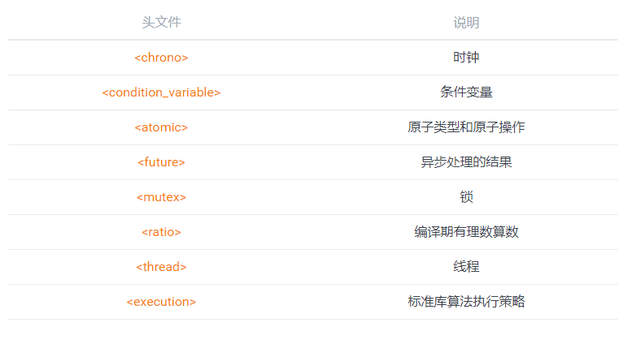

# 附录

## 标准库相关头文件

## 并发库对比

### [C++11 Thread](https://en.cppreference.com/w/cpp/thread)

### [Boost Thread](https://www.boost.org/doc/libs/1_71_0/doc/html/thread.html)

### [POSIX Thread](http://pubs.opengroup.org/onlinepubs/9699919799/basedefs/pthread.h.html)

